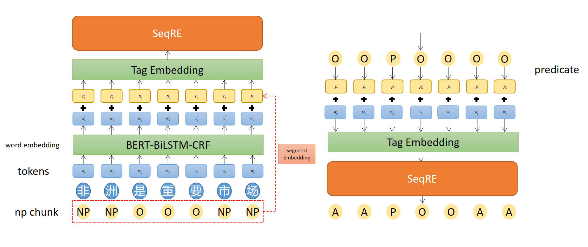

# Sequence Labeling
## 模型结构


## 项目文件结构
ckpts 用于存放模型check point 以及相关输出结果
configs 用于存储cfg文件，即用于配置模型的各种参数
data 用于存放数据集
doc 用于存放说明文档需要的图片，文档等数据
eval 用于存放测试脚本
models 用于存放模型文件
modules 用于存放模块文件
utils 用于存放一些工具类
eval.sh 测试启动脚本
run.py 模型训练主程序
run.sh 训练启动脚本
requirements.txt 项目所需要的第三方库
README.md 说明文档
## 训练
```
cd src
./run.sh
```

## 测试

```
cd src
./eval.sh
```

## cfg文件

cfg文件位于cfgs文件夹中，用于设置不同的训练任务和超参数设置，在调用eval.sh和run.sh时使用不同的cfg文件即可运行不同的任务。

## 数据集
数据集都位于data文件夹下。

#### 训练集
训练集使用的是oie2016，其格式如下：
```
words       ex_tag  pre     ext1    ext2
Courtaulds  NP      O       A0-B    O
'           NP      O       A0-I    O
spinoff     NP      O       A0-I    O
reflects    O       P-B     P-B     O
pressure    NP      O       A1-B    O
on          O       O       A1-I    O
British     NP      O       A1-I    A1-B
industry    NP      O       A1-I    A1-I
to          O       O       O       O
boost       O       P-B     O       P-B
share       NP      O       O       0-B
prices      NP      O       O       0-I
beyond      O       O       A2-B
the         NP      O       O       A2-I
reach       NP      O       O       A2-I
of          NP      O       O       A2-I
corporate   NP      O       O       A2-I
raiders     NP      O       O       A2-I
.           O       O       O       O
```
第一列为文本，第二列句子中蕴含的所有relation，第三列之后每一列都对应一个extraction的序列标注。

#### 开发集
使用的是CaRB的开发集，其格式如下：
```
32.7 % of all households were made up of individuals and 15.7 % had someone living alone who was 65 years of age or older .	were made up of	32.7 % of all households	individuals
```
是 sentence \t realtion \t argument1 \t argument2 \t argument3.... 的形式
#### 测试集
使用的是CaRB的测试集，其格式同上

### result

|   模型结构 | 训练集    | 测试集 | P | R | F1|
|   ----    | ----      | ---- | ---- | ---- | ----|
|   joint   | oie2016   | CaRB | 0.449 | 0.319 | 0.373|
|   joint   | oie2016   | CaRB | 0.449 | 0.319 | 0.373|
|joint_gold|oie2016|CaRB|0.439|0.345|0.386|
|joint_soft|oie2016|CaRB|0.479|0.343|0.400|
|pipeline|oie2016|CaRB|0.486|0.339|0.399|
|pipeline_gold|oie2016|CaRB|0.460|0.315|0.374|
|pipeline_soft|oie2016|CaRB|0.424|0.294|0.347|	